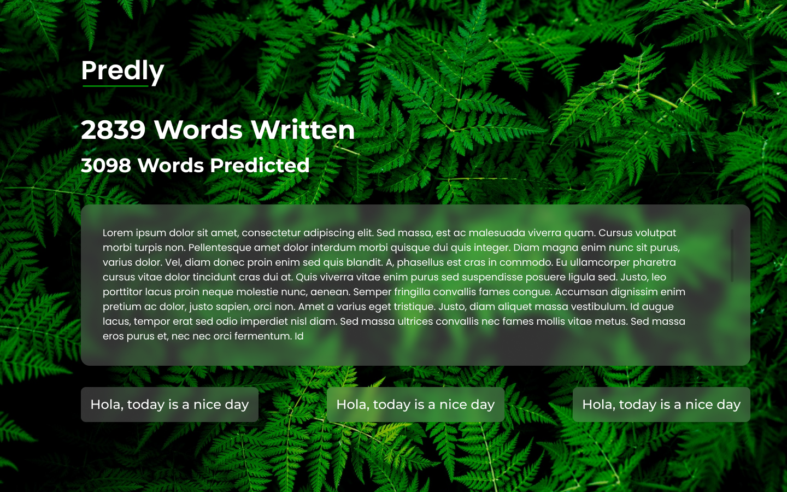
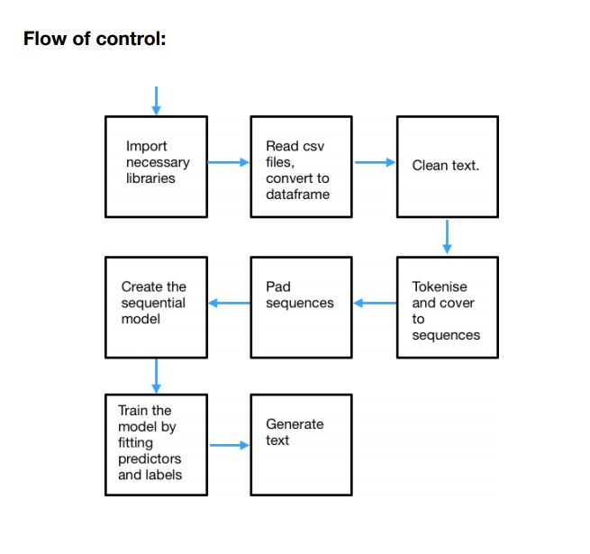
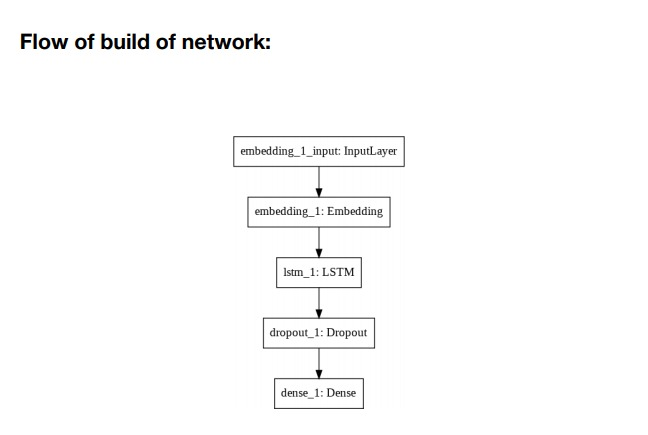
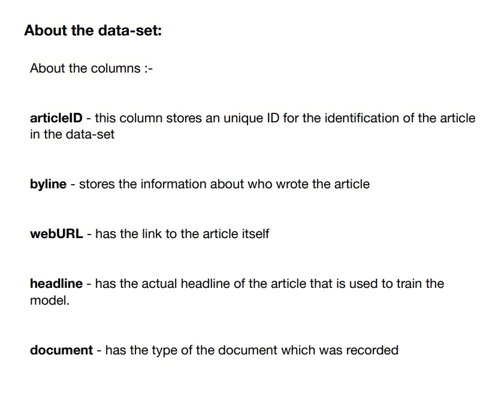
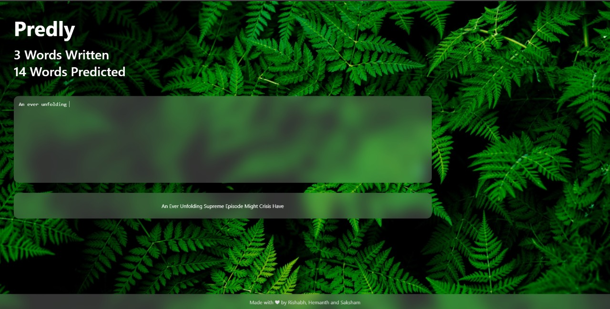
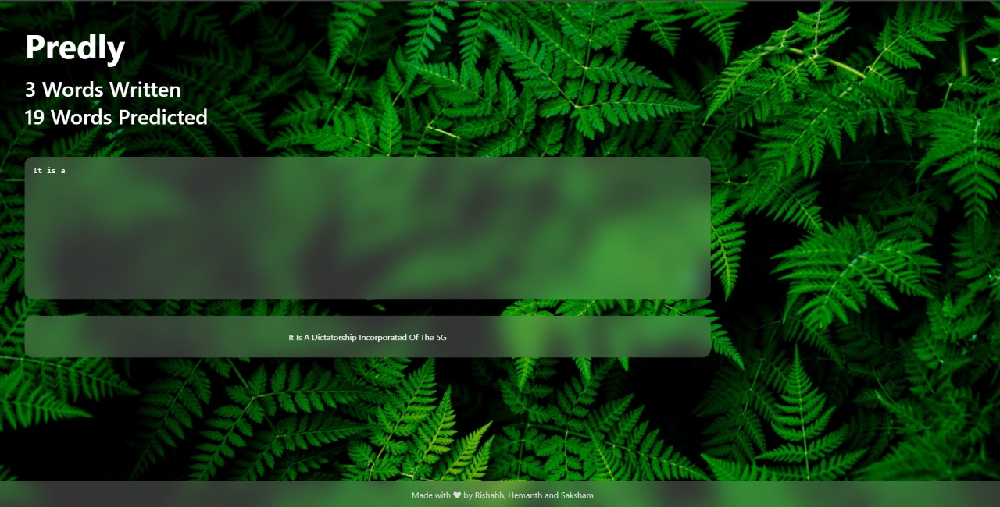

<h1 align="center">Predly - Your Smart Sentence Predictor</h1>

## _Complete your sentences in a jiffy with the sentence suggestions by Predly!_

## Languages and Tools

  
   

## Research and Methodology

## Results

## Getting Started

* Clone the repo:

`git clone https://github.com/rishabhkeshan/Predly.git && cd Predly`

### Server

* Install the required libraries from the requirements file

Run `pip3 install -r requirements.txt`

`cd app`

`python app.py` or `python3 app.py`

Open [http://localhost:8000](http://localhost:8000) to check if the server is running

### Webapp

`cd sentenceprediction`

Once you are in the project directory nstall the required dependencies using a package manager `yarn` or `npm`.

`yarn add` or `npm install`

`yarn start` or `npm start`

Runs the app in the development mode.
Open [http://localhost:3000](http://localhost:3000) to view it in the browser.

